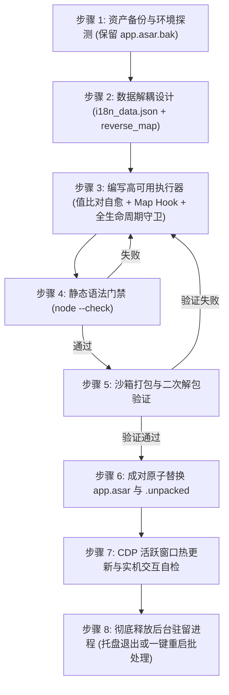

# Electron 桌面端软件深度汉化与防卡死工程规范

本技能整合了在 Electron 架构客户端（尤其是基于 React、Base UI、Monaco Editor 构建的现代复杂桌面应用）中进行**解包逆向、动态 DOM 汉化、架构解耦、防主进程崩溃、防渲染层死循环卡死与受控组件键值透传**的完整规章制度与生产级教训总结。

---

## 核心设计哲学 (Core Principles)

1. **数据与执行逻辑绝对解耦**：
   - 严禁将翻译字典以 JS 字符串字面量（特别是 ES6 反引号模板字符串 `` `...` ``）硬编码在执行逻辑中；
   - 翻译文本必须独立存储为标准的 `i18n_data.json`；
   - 渲染层脚本（`i18n_runner.js`）与主进程挂载脚本（`utils.js`）必须是独立的、零反引号嵌套冲突的静态文件。
2. **主进程全局生命周期守卫（Full Lifecycle Hook）**：
   - 严禁仅在初始窗口的 `dom-ready` 单点挂载注入逻辑；
   - 必须通过 `app.on('web-contents-created')` 建立全生命周期拦截网，对所有现有窗口、新建窗口、子窗口、F5 刷新、页面重载进行 100% 自动派发注入；
   - 即使渲染层脚本出错，主进程也绝不抛错，保证客户端始终能够稳定拉起。
3. **严格门禁（Gatekeeper）先行**：
   - 任何修改在写入生产封包（`app.asar`）前，必须 100% 自动通过 `node --check` 语法分析；
   - 必须在沙箱临时目录中执行“打包 ➔ 解包 ➔ 再次校验”闭环，验证通过后才执行原子替换。
4. **受控组件状态生命线保护**：
   - 汉化不能只停留在“把英文改成中文”，必须深入组件库（Base UI、Radix UI 等）的受控机制，保障数据流与事件流的双向一致性。
5. **SPA 响应式文本自愈机制**：
   - 现代 SPA 单页应用中组件和文本多为异步加载与路由复用，执行器必须具备动态值比对与渐进式重译能力，绝不采用永久性阻断标记。

---

## 惨痛教训与避坑红线 (Lessons Learned & Anti-Patterns)

### 🔴 教训一：反引号嵌套导致主进程 SyntaxError 启动崩溃
- **故障现象**：客户端启动弹窗报错 `SyntaxError: Unexpected identifier`，主进程树崩溃退出。
- **根本原因**：
  在拼接注入脚本时，外层使用了反引号模板字符串 `` `...` ``，而内层在处理动态文本（如 `` `查看 ${num} 项明细` ``）时同样使用了未转义的反引号。内层反引号导致外层字符串提前闭合，其后的中文关键字暴露为非法裸 Token，造成 JS 引擎语法解析致命错误。
- **规章死线**：
  1. **严禁在代码生成脚本中多层嵌套反引号**；
  2. 字符串拼接一律退回安全的 ES5 单引号/双引号加号拼接（`"查看 " + num + " 项明细"`）；
  3. 所有打包流水线必须强插 `node --check` 门禁，语法报错即刻终止打包。

---

### 🔴 教训二：`characterData: true` 监听引发渲染线程无限递归卡死
- **故障现象**：用户在系统设置中点击下拉选项或输入文字时，整个窗口完全卡死、无响应，CPU 占用率飙升至 100%。
- **根本原因**：
  `MutationObserver` 开启了 `characterData: true`。当用户切换选项时，React 更新了 DOM 文本节点；观察器捕获到 `characterData` 变更并调用 `translateNode` 修改 `node.nodeValue`；**修改 `node.nodeValue` 本身会立即向微任务队列中抛出新的 `characterData` mutation**，从而引发观察器自身在微任务阶段的无限递归死循环。
- **规章死线**：
  1. **绝对严禁在全文档范围开启 `characterData: true` 监听**！
  2. 观察器配置永远锁定为：`{ childList: true, subtree: true }`；
     - 现代 SPA（React、Vue 等）的页面渲染、子路由切换、弹窗展开、下拉列表挂载，均属于标准 DOM 节点树的增删（`childList`），完全足以覆盖 100% 的界面翻译需求；
  3. **必须配置防重入原子锁**：
     ```javascript
     var isTranslating = false;
     var obs = new MutationObserver(function (mutations) {
         if (isTranslating) return;
         isTranslating = true;
         try {
             for (var i = 0; i < mutations.length; i++) {
                 if (mutations[i].type === "childList") {
                     for (var j = 0; j < mutations[i].addedNodes.length; j++) {
                         translateSubtree(mutations[i].addedNodes[j]);
                     }
                 }
             }
         } finally {
             isTranslating = false;
         }
     });
     ```

---

### 🔴 教训三：有害的 `WeakSet` 导致 SPA 路由切换与异步文本永久变回英文（重大反模式！）
- **故障现象**：界面初次打开部分文本未翻译，或者在单页路由（SPA）切换页面、展开二级列表后，原本应该汉化的文本依然保持英文，刷新后又失效。
- **根本原因**：
  原执行器盲目使用 `translatedNodes = new WeakSet()`，在初次扫描时将未完成异步数据绑定的节点（或占位符节点）直接标记为“已处理”。当 React 异步填充真实数据、或者在 SPA 内部复用该 DOM TextNode 时，由于 `translatedNodes.has(node)` 返回 `true`，后续所有的重译请求被直接静默拦截！
- **规章死线**：
  1. **严禁使用节点引用级的 `WeakSet` 永久黑名单**！
  2. **采用“纯值比对法”（Value Matching）**：
     ```javascript
     function translateTextNode(textNode) {
         if (!textNode || textNode.nodeType !== 3) return;
         var val = textNode.nodeValue;
         if (!val || !val.trim()) return;
         if (isInsideExcluded(textNode)) return;

         var translated = getTranslatedText(val);
         // 仅当查找到翻译且值不相同时才赋值
         if (translated !== null && translated !== val) {
             textNode.nodeValue = translated;
         }
     }
     ```
     - 当文本是英文时，精准命中并替换为中文；
     - 当文本已被替换为中文后，`getTranslatedText(val)` 查不到对应英文键，返回 `null`，**绝不发生二次修改，0% 递归风险**；
     - 当 React 在路由切换时赋上新的英文文本，由于没有 `WeakSet` 阻断，系统能**毫秒级自愈并重新汉化**！

---

### 🔴 教训四：组件库“英文键值映射”受控状态失配（Key Mismatch）
- **故障现象**：点击特定下拉选项（如“安全预设模式”、“成果审查策略”）后，选项不会被选中，弹窗无法关闭，背景遮罩阻断所有鼠标点击，界面呈现假死。
- **根本原因**：
  前端组件（如 Base UI `Select` 或自定义受控组件）在内部使用原生英文构建了选项查找表：
  ```javascript
  // 内部注册的原版 Map
  var p = new Map([
      ["Always Ask", "always"],
      ["Always Proceed", "turbo"]
  ]);
  // 选项变更回调
  onValueChange: r => { p.has(r) && e(p.get(r)) }
  ```
  当 DOM 文本被翻译为 `"自动继续"` 后，Base UI 会将展示文本作为值回传给 `onValueChange(r)`。由于 `p.has("自动继续")` 为 `false`，核心回调 `e(...)` 被静默拒绝，导致 React 状态未能提交，受控浮层陷入无法关闭的死锁。
- **规章死线**：
  1. **构建双向映射字典（`reverse_map`）**：
     必须同时收集所有受控选项的中文到英文映射关系；
  2. **在渲染层全局拦截 `Map.prototype.has` 与 `Map.prototype.get`（双向映射桥）**：
     ```javascript
     (function () {
         var REVERSE_MAP = data.reverse_map || {};
         if (!window.__antigravity_map_hooked) {
             window.__antigravity_map_hooked = true;
             var origHas = Map.prototype.has;
             var origGet = Map.prototype.get;

             Map.prototype.has = function (key) {
                 if (origHas.call(this, key)) return true;
                 var rev = window.__ANTIGRAVITY_REVERSE_MAP__ || REVERSE_MAP;
                 if (typeof key === "string" && rev[key]) {
                     return origHas.call(this, rev[key]);
                 }
                 return false;
             };

             Map.prototype.get = function (key) {
                 var val = origGet.call(this, key);
                 if (val !== undefined) return val;
                 var rev = window.__ANTIGRAVITY_REVERSE_MAP__ || REVERSE_MAP;
                 if (typeof key === "string" && rev[key]) {
                     return origGet.call(this, rev[key]);
                 }
                 return undefined;
             };
         }
     })();
     ```

---

### 🔴 教训五：系统托盘/后台守护导致主进程“假退出与旧内存锁死”（退出重开变回英文的元凶）
- **故障现象**：汉化并替换 `app.asar` 后，用户点击窗口右上角“X”关闭并重新从桌面打开，界面依然是旧版英文。
- **根本原因**：
  现代桌面应用普遍配置了“常驻托盘 / 后台运行”（如 `RUN_IN_BACKGROUND`）。
  当用户点击窗口右上角“X”时，Electron 仅仅销毁或隐藏了 BrowserWindow，主进程并未真正退出，常驻在系统托盘中。用户从桌面再次双击快捷方式时，触发了 `second-instance` 事件，新进程把信号传给旧主进程后退出。常驻的旧主进程从内存中拉起窗口，由于 Node.js 的 `require.cache` 依然保留在内存中，根本没有重新加载磁盘上新打入的 `app.asar`！
- **规章死线**：
  1. **部署时必须彻底清理后台残留进程**：
     必须指导用户通过托盘右键彻底选择“退出”，或通过运维命令 `taskkill /f /im App.exe` 彻底结束所有残留进程后重新拉起；
  2. **配套交付一键重启脚本**：
     编写包含“进程强杀 ➔ 延迟 1 秒释放句柄 ➔ 重新拉起新实例”的自动化批处理工具（`重启并持久生效.bat`）；
  3. **唤醒链路防御性补救**：
     在主进程的 `second-instance` 事件和 `showOrCreateWindow` 唤醒逻辑中，强制对唤醒的窗口执行一次补救式动态注入。

---

### 🔴 教训六：单点 `dom-ready` 注入脆弱性与全生命周期守卫缺失
- **故障现象**：用户在客户端内按 F5 刷新、窗口重载、或打开新窗口时，汉化完全失效变回英文。
- **根本原因**：
  注入脚本只在 `createWindow` 内部对 `win.webContents.on('dom-ready')` 单点绑定。在 SPA 架构中，初次 `dom-ready` 时 HTML 可能只是空白骨架屏，组件异步渲染；一旦用户刷新页面或客户端跳转，单点钩子无法覆盖新的生命周期。
- **规章死线**：
  1. **注册全局 WebContents 拦截器**：
     必须在 `app.whenReady()` 中注册：
     ```javascript
     app.on('web-contents-created', (_event, wc) => {
         wc.on('dom-ready', () => injectI18n(wc));
         wc.on('did-finish-load', () => injectI18n(wc));
         wc.on('did-navigate-in-page', () => injectI18n(wc));
     });
     ```
  2. **局部显式绑定双保险**：
     在 `createWindow` 内部依然保留对 `win.webContents` 的显式绑定，形成“全局守卫 + 局部显式”双保险，彻底覆盖新建、刷新、重载与子窗口。

---

### 🔴 教训七：嵌套内联标签（`<a>` / `<span>`）导致的文本节点切片（TextNode Fragmentation）失配
- **故障现象**：某句说明文本已录入词库，但界面上呈现半中半英（如 `Configure the browser subagent. It requires Google Chrome to be installed.`）。
- **根本原因**：
  当一个英文句子中间嵌套了超链接（如 `<a>Google Chrome</a>`）或 Badge 徽标时，浏览器 DOM 解析器会将该句子拆分为多个独立的 TextNode：
  - TextNode 1: `"Configure the browser subagent. It requires "`
  - Element: `<a>Google Chrome</a>`
  - TextNode 2: `" to be installed."`
  字典中的整句匹配规则永远无法匹配任何一个被截断的片段。
- **规章死线**：
  必须深入探查 DOM 树，将切片后的前后独立 TextNode 分别提取为精准词条进行配对翻译：
  - `"Configure the browser subagent. It requires"` ➔ `"配置浏览器子智能体。此功能依赖于"`
  - `"to be installed."` ➔ `" 浏览器支持。"`
  拼装后语意自然流畅，彻底杜绝中英混杂。

---

### 🔴 教训八：执行器闭包隔离导致在线热重载（Hot Reloading）失效
- **故障现象**：通过 CDP 或控制台注入更新后的词典数据后，页面文本未发生变化。
- **根本原因**：
  执行器采用了 IIFE 闭包，并在头部判断 `if (window.__antigravity_i18n_runner_active) return;`。当再次热注入新代码时，新闭包直接 return，旧闭包中的局部变量 `EXACT` 依然指向第一次注入时的旧对象。
- **规章死线**：
  1. 必须在热注入时动态将最新数据挂载到全局变量（如 `window.__ANTIGRAVITY_EXACT__ = Object.assign(...)`）；
  2. 在 `getTranslatedText` 和 `reverse_map` 中优先读取全局挂载的最新对象；
  3. 若检测到执行器已激活，主动触发一次 `translateWholePage()` 执行全量增量重译。

---

### 🔴 教训九：`.unpacked` 目录与 `app.asar` 解耦失步
- **故障现象**：修改或重构 `app.asar` 后，软件启动时报模块加载失败或原生二进制缺失（如 `chrome-devtools-mcp`）。
- **根本原因**：
  Electron 会将包含 C/C++ 动态链接库（`.node` / `.exe`）的依赖解压存放于 `app.asar.unpacked` 目录中。若重打包时未加 `--unpack-dir` 声明，或替换生产包时未同步替换配套的 `.unpacked` 文件夹，会导致底层依赖寻址 404。
- **规章死线**：
  打包时必须指明解包白名单，部署时必须成对原子替换：
  ```bash
  npx @electron/asar pack "<src>" "<out.asar>" --unpack-dir "node_modules/chrome-devtools-mcp"
  # 部署时必须保持同名配套
  copy out.asar app.asar
  copy out.asar.unpacked app.asar.unpacked
  ```

---

### 🔴 教训十：全文档 $O(N)$ 遍历与缺少快速放行导致渲染卡顿（“先英后中、延迟卡顿”的根因）
- **故障现象**：用户操作界面感觉“卡卡的”，界面加载时不是第一时间就呈现中文，而是先闪出原生英文、等待数百毫秒后才突然变成中文。
- **根本原因**：
  1. 执行器在不区分大小写匹配时，对数千条字典项执行 `for (var key in exactMap)` 并在循环中持续调用 `key.toLowerCase() === lower`。每次页面发生微小渲染时，数百个 TextNode 触发数万乃至几十万次字符串分配和循环，霸占主 UI 线程导致严重丢帧（Jank）；
  2. 已经汉化的中文文本、用户发送的中文会话、数字和标点符号依然反复遍历所有正则和词库规则。
- **规章死线**：
  1. **预编译小写哈希索引表（$O(1)$ 查询）**：
     启动及数据更新时自动构建 `LOWER_EXACT = Object.create(null)`，大小写不敏感匹配直接通过哈希常数级命中；
  2. **拉丁字符超快门禁放行（Latin ASCII Fast-Exit）**：
     在函数入口处添加：
     ```javascript
     if (!/[a-zA-Z]/.test(trimmed)) return null;
     ```
     在 0.001 毫秒内瞬间放行所有纯中文、代码符号、纯数字等非英文文本，减少 90% 以上无效计算；
  3. **叶子节点属性扫描剪枝**：
     在 `translateSubtree(root)` 中，仅当 `root.childElementCount > 0` 时才执行 `root.querySelectorAll(...)`，杜绝数千个末梢节点的无效 DOM 树搜索。

---

### 🔴 教训十一：复用 TextNode（浮窗 Tooltip、悬停额度）导致的快速切换变回英文与无感同步拦截
- **故障现象**：在额度查看浮层或快速悬停各组件时，鼠标只要快速移动切换目标，Tooltip 浮窗就变回英文；或者浮层内容在英中之间来回闪烁。
- **根本原因**：
  1. React / Base UI 为提升性能，在 Portal 浮窗中长期复用同一个 DOM TextNode 容器。当鼠标移动到新的目标时，React 直接赋值 `textNode.nodeValue = "新说明文本"` 或 `element.textContent = ...`；
  2. 根据【教训二】，为了防止递归死循环，`MutationObserver` 严禁监听 `characterData: true`，因此观察器完全无法感知底层文本节点的就地变更；
  3. 异步扫描延迟（100ms+）在快速鼠标悬停时赶不上用户的视线移动速度。
- **规章死线**：
  1. **同步挂载底层原生 Setter 拦截器（零延迟无感直译）**：
     同步劫持 `Node.prototype.nodeValue` 与 `Node.prototype.textContent` 的原生 setter：
     ```javascript
     var origSetVal = Object.getOwnPropertyDescriptor(Node.prototype, "nodeValue").set;
     Object.defineProperty(Node.prototype, "nodeValue", {
         set: function (val) {
             if (typeof val === "string" && val.length > 0 && !isInsideExcluded(this)) {
                 var trans = getTranslatedText(val);
                 if (trans !== null) val = trans;
             }
             return origSetVal.call(this, val);
         }
     });
     ```
     在 React 赋值的同一步微任务中同步将英文替换为中文，浏览器渲染出来的第一帧即为标准中文，彻底实现 0ms 零闪烁直出；
  2. **悬停事件主动透视扫描**：
     在 `mouseover` 事件中，除处理 `e.target` 外，同步对文档中所有活跃浮窗（`.compact-tooltip`, `[role="tooltip"]`）进行即时扫描重译；
  3. **模型与受控组件后缀动态逆向映射**：
     对 `Claude Sonnet 4.6 (Thinking)` ➔ `Claude Sonnet 4.6 (思考)`、`GPT-OSS 120B (Medium)` ➔ `GPT-OSS 120B (中)` 等动态受控组件，必须在 `resolveReverseKey` 中配置反向动态剥离，确保受控组件点击选择回调准确无误。

---

### 🔴 教训十二：浮窗快捷键颜色弱化与官方设计系统风格统一
- **故障现象**：在设置浮窗中，“设置 Ctrl+,”的快捷键为低饱和度半透明灰色，而发送消息、立即发送、排队发送、取消等浮窗中的快捷键为刺眼的纯白色或样式混乱。
- **根本原因**：
  1. Google Antigravity 官方组件体系（Base UI / Tailwind）将浮窗中的快捷键规范为 `<span class="ml-1 opacity-50">快捷键</span>`，使快捷键在视觉层级上次于主要操作文案；
  2. 纯文本汉化将整个字符串拼接输出（如 `取消 Ctrl+D`），导致渲染引擎以统一的纯白色前景色高亮整句；
  3. 若直接粗暴向所有元素插入 HTML，极易导致 DOM 重复嵌套或者污染无障碍读屏器的 `aria-label` 属性。
- **规章死线**：
  1. **结构化快捷键分离渲染**：
     执行器捕获浮窗（`.compact-tooltip`, `[role="tooltip"]`, `.react-tooltip`）时，识别末尾快捷键，并自动格式化为标准官方结构：
     ```html
     <span>动作文案</span><span class="ml-1 opacity-50">快捷键</span>
     ```
  2. **多行与单行叶子节点防重叠递归**：
     当浮窗为多行容器（如排队与立即发送组合）时，仅对叶子 `div` 节点注入样式；且当容器内已包含 `.opacity-50` 类时瞬间跳过，确保 100% 幂等无回流；
  3. **属性与 DOM 语义分离**：
     无障碍属性 `aria-label` 必须严格保持纯文本格式（如 `aria-label="取消 Ctrl+D"`），严禁注入 HTML 标签；HTML 高亮与弱化样式仅作用于可视浮窗内。

---

## 自动化深度探测技术 (Automated Probing Tooling)

在面对含有几十个 Tab、嵌套弹窗、复杂受控组件的现代 SPA 时，仅靠人工肉眼极易发生缺漏。**必须建立基于 Chrome DevTools Protocol (CDP) 的全自动巡检体系**：

1. **自动遍历 Tab 树**：
   编写轻量 Node.js 脚本连接活跃调试端口（如 `1096`），模拟点击设置弹窗的左侧所有 Tab、项目列表、二级分类；
2. **全树未汉化文本提取器**：
   使用 `document.createTreeWalker(root, NodeFilter.SHOW_TEXT)` 结合正则 `/[a-zA-Z]/ && !/[\u4e00-\u9fa5]/`，自动过滤代码块、Token、邮箱与 URL，将所有可见英文字符串一键导出；
3. **属性深度覆盖**：
   同步探测 `[placeholder]`, `[title]`, `[aria-label]`, `[alt]` 等属性，确保无死角汉化。

---

## 汉化实施标准作业程序 (Standard Operating Procedure - SOP)



### 步骤清单与自检卡点

| 阶段 | 核心任务 | 自检标准与安全红线 |
| :--- | :--- | :--- |
| **1. 备份** | 复制官方原始包 | 必须确保 `app.asar.bak` 完整存在于资源目录 |
| **2. 字典** | 构建正反双向词典 | `i18n_data.json` 纯合法 JSON；收集受控组件 `reverse_map`；拆解嵌套标签切片文本 |
| **3. 逻辑** | 编写 `i18n_runner.js` | 仅监听 `childList`；使用纯值比对自愈（禁用阻断性 `WeakSet`）；挂载 `Map.prototype` 拦截桥；支持全局热更新 |
| **4. 主进程** | 挂载全生命周期 | 在 `main.js` 注册 `app.on('web-contents-created')`，并在 `utils.js` 显式绑定 |
| **5. 门禁** | 语法检查 | 对 `main.js`、`utils.js`、`i18n_runner.js` 执行 `node --check`，退出码必须为 0 |
| **6. 沙箱** | 模拟打包解包 | 打包为 `test.asar` ➔ 解包至临时目录 ➔ 再次执行 `node --check` |
| **7. 部署** | 原子替换 | `app.asar` 与 `app.asar.unpacked` 必须同时且同名替换 |
| **8. 探测** | CDP 自动化巡检 | 运行自动化遍历脚本，确保所有 Tab 与二级弹窗未汉化数组为清空状态 |
| **9. 释放** | 释放托盘后台进程 | 提供一键重启批处理脚本，彻底终结旧主进程驻留，确保新 `app.asar` 从磁盘加载生效 |

---

## 总结

对现代化复杂桌面软件（Electron + React）进行本地化改造，**绝不仅仅是文本替换，而是一项兼顾运行态生命周期、进程树常驻机制、底层微任务调度与组件库受控特性的系统工程**。恪守“数据解耦、双向映射、单向监听、值比自愈、全生命周期守卫、彻底释放驻留”核心准则，方能交付出工业级、零崩溃、如原生般流畅持久的本地化体验。
